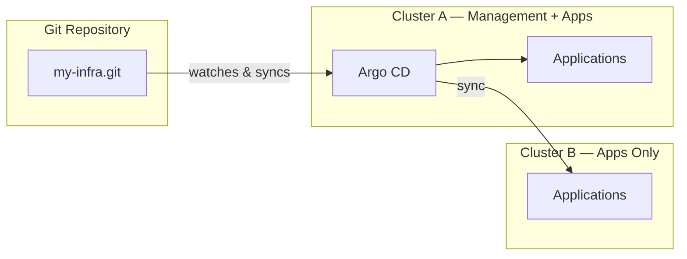

Multiple Kubernetes clusters help you dedicate applications by service category. But managing multiple Kubernetes clusters can sometimes get difficult.


This article will show you how to use Argo CD and GitOps to manage multiple Kubernetes clusters.

# Why Managing Multiple Clusters Is Hard

Managing multiple Kubernetes clusters is hard because it multiplies operational overhead, causes configuration drift, and complicates governance.

## Operational Overhead and Manual Work

- **Repetitive deployment** — the same manifests are applied cluster by cluster with `kubectl apply`, wasting time and inviting typos
- **No single source of truth** — the cluster's live state is the only record of what's running, with no version history behind it
- **Wrong-cluster mistakes** — pointing a command at the wrong context can silently update the wrong environment

## Configuration Drift and Governance

- **State divergence** — manual changes or staggered rollouts mean clusters slowly fall out of sync, causing unpredictable bugs
- **No audit trail** — someone edited a Deployment by hand and no one can tell what changed, when, or why
- **Inconsistent policies** — replicating RBAC, secrets, and configs across clusters creates blind spots

## Version Consistency

- **Mixed versions** — one cluster runs v1.2 while another still runs v1.0, and the gap is only discovered in production
- **Slow, error-prone rollouts** — promoting a new version across all clusters is a manual checklist instead of a repeatable process

# What Is Argo CD

Argo CD is a declarative GitOps tool for Kubernetes that continuously watches your Git repository and automatically syncs your clusters to match the desired state defined there.

In a GitOps workflow, your Git repository is the single source of truth — the place where your entire cluster state lives, versioned and reviewed like code.

# Setup: Cluster A and Cluster B

To see this in action, let's use two clusters:

- **Cluster A** — the management cluster. Argo CD is installed here, and it also runs applications
- **Cluster B** — an application-only cluster. No Argo CD here; it just runs the apps you deploy to it

Argo CD installed in Cluster A watches your Git repository and syncs apps to **both** clusters — Cluster B needs nothing installed, only its credentials registered with Argo CD.



# How to Deploy Argo CD

## Step 1 — Install the Chart

The fastest way to get Argo CD running is the official Helm chart from the `argo-helm` repository:

```bash
helm repo add argo https://argoproj.github.io/argo-helm
helm repo update
kubectl create namespace argocd
```

## Step 2 — values.yaml

A production setup usually goes beyond the chart defaults. Here is an example `values.yaml` that customizes repo credentials, RBAC, scaling, and SSO:

```yaml
configs:
  cm:
    create: true
    kustomize.buildOptions: --enable-helm

  credentialTemplates:
    https-creds:
      url: https://gitlab.example.com/my-org/my-infra.git
      username: <your-gitlab-username>
      password: <your-gitlab-token>

redis-ha:
  enabled: true

server:
  extraArgs:
    - --insecure
    - --enable-gzip
  service:
    type: ClusterIP
  autoscaling:
    enabled: true
    minReplicas: 2

repoServer:
  autoscaling:
    enabled: true
    minReplicas: 2

applicationSet:
  replicas: 2

dex:
  enabled: false
```

Here's what each section does:

- **`configs.cm`** — settings for Argo CD's main ConfigMap. `kustomize.buildOptions: --enable-helm` lets Kustomize render Helm charts as part of a build
- **`configs.credentialTemplates`** — a reusable set of Git credentials (`https-creds`) Argo CD uses to clone private repositories like your GitLab repo. The placeholders should be replaced with a real username and access token
- **`redis-ha`** — deploys Redis in high-availability mode, which Argo CD uses for caching. Set to `true` for resilience across failures
- **`server.extraArgs`** — flags passed to the Argo CD API server. `--insecure` disables the internal TLS layer, `--enable-gzip` compresses API responses
- **`server.service.type: ClusterIP`** — keeps the server internal and reachable only inside the cluster; you access it later via port-forwarding
- **`server.autoscaling`** / **`repoServer.autoscaling`** — auto-scales the API server and repo server to at least 2 replicas each to handle more apps and clusters
- **`applicationSet.replicas`** — the ApplicationSet controller runs 2 replicas (it generates Applications for multiple clusters from templates)
- **`dex.enabled: false`** — disables Dex SSO since we only use the local `admin` account; re-enable it if you want login via an external identity provider

```sh
helm install argocd argo/argo-cd -n argocd -f values.yaml
```

The install targets the current kubeconfig context, so this command deploys Argo CD into **Cluster A** — your management cluster. Nothing is installed on Cluster B.

## Step 3 — Get the Admin Password

The chart stores the admin password in a secret. Decode it with:

```bash
kubectl -n argocd get secret argocd-initial-admin-secret \
  -o jsonpath="{.data.password}" | base64 -d
```

## Step 4 — Access the UI

```bash
kubectl port-forward svc/argocd-server -n argocd 8080:80
```

Open `http://localhost:8080`, sign in as `admin`, and you'll see an empty Applications view — ready for you to register your clusters and apps.

## Step 5 — Install CRDs on Cluster B

Argo CD uses three custom resource types (CRDs): Application, ApplicationSet, and AppProject. Cluster A gets them automatically when you install the chart, but Cluster B does not — if you plan to deploy Argo CD resources (an app-of-apps pattern) onto Cluster B, it needs the CRDs installed too.

Install them from the official manifests:

```bash
kubectl apply -k https://github.com/argoproj/argo-cd/manifests/crds
```

The `crds` directory ships a `kustomization.yaml` covering `application-crd.yaml`, `applicationset-crd.yaml`, and `appproject-crd.yaml`.

## Step 6 — Register Cluster B with a Service Account

Argo CD needs cluster-admin access on Cluster B to manage its resources. The recommended way to grant it is a dedicated `argocd-manager` ServiceAccount — this keeps Cluster B independent from your local credentials.

First, create the `argocd` namespace on Cluster B:

```bash
kubectl create namespace argocd
```

Then create these resources on Cluster B:

```yaml
---
apiVersion: v1
kind: ServiceAccount
metadata:
  name: argocd-manager
  namespace: argocd

---
apiVersion: v1
kind: Secret
metadata:
  name: argocd-manager-token
  namespace: argocd
  annotations:
    kubernetes.io/service-account.name: argocd-manager
type: kubernetes.io/service-account-token

---
apiVersion: rbac.authorization.k8s.io/v1
kind: ClusterRole
metadata:
  name: argocd-manager-role
rules:
  - apiGroups: ["*"]
    resources: ["*"]
    verbs: ["*"]
  - nonResourceURLs: ["*"]
    verbs: ["*"]

---
apiVersion: rbac.authorization.k8s.io/v1
kind: ClusterRoleBinding
metadata:
  name: argocd-manager-binding
roleRef:
  apiGroup: rbac.authorization.k8s.io
  kind: ClusterRole
  name: argocd-manager-role
subjects:
  - kind: ServiceAccount
    name: argocd-manager
    namespace: argocd
```

Then add the cluster to Argo CD using the ServiceAccount token in the next step.

## Step 7 — Register the Cluster Declaratively

Register Cluster B declaratively by creating a Secret on Cluster A (in the `argocd` namespace) with the label `argocd.argoproj.io/secret-type: cluster`. Argo CD watches for these Secrets and automatically adds the cluster.

```yaml
---
apiVersion: v1
kind: Secret
metadata:
  labels:
    argocd.argoproj.io/secret-type: cluster
  name: argocd-cluster-b
  namespace: argocd
stringData:
  config: |
    {"bearerToken":"xxxx","tlsClientConfig":{"caData":"x","insecure":false}}
  name: cluster-b
  server: https://cluster-b-api.example.com:6443
type: Opaque
```

Apply it on Cluster A and Argo CD will pick up Cluster B automatically. Replace `bearerToken` with the ServiceAccount token, `caData` with Cluster B's certificate authority, and `server` with Cluster B's API server URL (for example `https://cluster-b-api.example.com:6443`).

## Step 8 — Deploy Applications to Both Clusters

With both clusters registered, you define what to deploy. Start with an `AppProject` — a logical grouping that controls which repositories, destinations, and resources an app can use:

```yaml
apiVersion: argoproj.io/v1alpha1
kind: AppProject
metadata:
  name: my-project
  namespace: argocd
spec:
  clusterResourceWhitelist:
  - group: '*'
    kind: '*'
  description: My Argo CD project
  destinations:
  - namespace: '*'
    server: https://kubernetes.default.svc
  - namespace: '*'
    server: https://cluster-b-api.example.com:6443
  orphanedResources:
    warn: false
  sourceRepos:
  - '*'
```

Next, a single `Application` that points at a folder in your Git repo and a destination cluster. This one targets Cluster A:

```yaml
apiVersion: argoproj.io/v1alpha1
kind: Application
metadata:
  name: my-app
  namespace: argocd
spec:
  project: my-project
  source:
    directory:
      recurse: true
    repoURL: https://gitlab.example.com/my-org/my-infra.git
    targetRevision: main
    path: apps/my-app/overlay/my-env/applications
  destination:
    server: https://kubernetes.default.svc
    namespace: argocd
```

When you have many apps and clusters, an `ApplicationSet` generates Applications from a template instead of writing them by hand. This one creates one app per app/cluster combination across both clusters:

```yaml
apiVersion: argoproj.io/v1alpha1
kind: ApplicationSet
metadata:
  name: my-appset
  namespace: argocd
spec:
  generators:
    - matrix:
        generators:
          - list:
              elements:
                - app: api
                  path: api
                - app: web
                  path: web
                - app: worker
                  path: worker
          - list:
              elements:
                - cluster: cluster-a
                  server: https://kubernetes.default.svc
                - cluster: cluster-b
                  server: https://cluster-b-api.example.com:6443
  template:
    metadata:
      name: "{{app}}-{{cluster}}"
      labels:
        domain: my-project
    spec:
      project: my-project
      source:
        repoURL: https://gitlab.example.com/my-org/my-infra.git
        targetRevision: main
        path: "apps/my-app/overlay/my-env/{{path}}"
      destination:
        server: "{{server}}"
        namespace: default
  syncPolicy:
    preserveResourcesOnDeletion: true
```

The ApplicationSet matrix generator combines the app list with the cluster list, producing six applications (`api-cluster-a`, `api-cluster-b`, `web-cluster-a`, and so on). Change a manifest in Git and Argo CD rolls it out to every matching app and cluster automatically.

