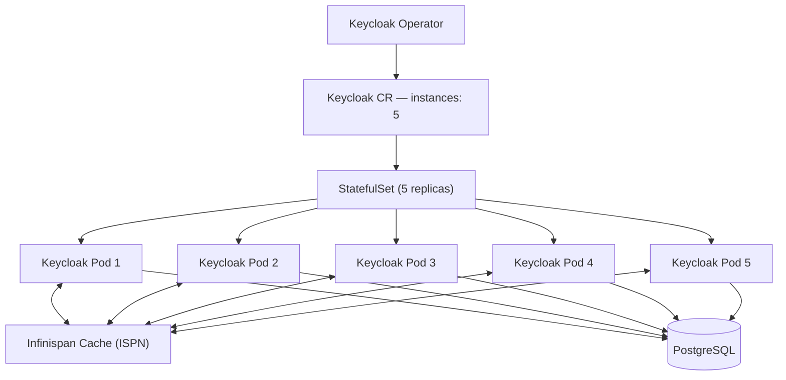

# What Is Keycloak

Keycloak is an open-source identity and access management (IAM) solution. It provides single sign-on (SSO), social login, user federation, and role-based access control out of the box — speaking standard protocols like OIDC, OAuth 2.0, and SAML, so your applications don't have to build auth themselves.

# What Is the Keycloak Operator

The Keycloak Operator is a Kubernetes controller that manages the full Keycloak lifecycle declaratively. You define a `Keycloak` custom resource (CR) in YAML — the operator watches it and creates, scales, and updates the actual Keycloak deployment to match what you declared.

# Prerequisites

Before you start, you only need two things:

- **Kubernetes cluster** — a running cluster; any environment works (managed cloud or on-premises)
- **kubectl** — configured to talk to that cluster

# Install the Keycloak Operator

The operator ships as plain Kubernetes manifests in the `keycloak-k8s-resources` repository. Apply the two custom resource definitions (CRDs) first, then the operator itself:

```bash
kubectl apply -f https://raw.githubusercontent.com/keycloak/keycloak-k8s-resources/26.3.3/kubernetes/keycloaks.k8s.keycloak.org-v1.yml
kubectl apply -f https://raw.githubusercontent.com/keycloak/keycloak-k8s-resources/26.3.3/kubernetes/keycloakrealmimports.k8s.keycloak.org-v1.yml
kubectl apply -f https://raw.githubusercontent.com/keycloak/keycloak-k8s-resources/26.3.3/kubernetes/kubernetes.yml
```

- **`keycloaks.k8s.keycloak.org-v1.yml`** — the CRD for the `Keycloak` resource, which defines the Keycloak server instance itself
- **`keycloakrealmimports.k8s.keycloak.org-v1.yml`** — the CRD for `KeycloakRealmImport`, used to manage realms and clients declaratively
- **`kubernetes.yml`** — the operator deployment, its RBAC rules, and service account

Verify the operator is running in the `keycloak-system` namespace:

```bash
kubectl get pods -n keycloak-system
```

You should see the operator pod with a `Running` status. Once it's up, the operator is ready to reconcile your `Keycloak` custom resources.

# Deploy Keycloak with the Keycloak CR

With the operator running, you define the Keycloak instance as a `Keycloak` custom resource. Here is the full example configuration this guide is built around — create the `keycloak` namespace and apply it:

```bash
kubectl create namespace keycloak
```

```yaml
apiVersion: k8s.keycloak.org/v2alpha1
kind: Keycloak
metadata:
  name: keycloak
  namespace: keycloak
  labels:
    app: keycloak
spec:
  ingress:
    enabled: false

  http:
    httpEnabled: true

  hostname:
    hostname: keycloak.example.com

  proxy:
    headers: xforwarded

  additionalOptions:
    - name: proxy
      value: edge # assumes TLS is terminated upstream (ingress/load balancer)
    - name: hostname-strict
      value: "false" # allow requests to the hostname over both HTTP and HTTPS
    - name: log-console-output
      value: json # structured JSON logs for easier aggregation
    - name: metrics-enabled
      value: "true" # expose Prometheus metrics from the Keycloak server
    - name: event-metrics-user-enabled
      value: "true" # add login/registration metrics per user event
    - name: cache
      value: ispn # use the embedded Infinispan cache
    - name: cache-stack
      value: kubernetes # Infinispan discovers peers via Kubernetes DNS
    - name: db-pool-initial-size
      value: "100" # initial JDBC connection pool size
    - name: db-pool-min-size
      value: "100" # minimum JDBC connection pool size
    - name: db-pool-max-size
      value: "200" # maximum JDBC connection pool size

  db:
    vendor: postgres
    url: jdbc:postgresql://postgres:5432/keycloak
    usernameSecret:
      name: keycloak-db-secret
      key: username
    passwordSecret:
      name: keycloak-db-secret
      key: password

  image: quay.io/keycloak/keycloak:26.0
  startOptimized: false
  instances: 5

  resources:
    requests:
      cpu: "1"
      memory: "1Gi"
    limits:
      cpu: "4"
      memory: "4Gi"

  unsupported:
    podTemplate:
      spec:
        containers:
        - name: keycloak
          env:
            - name: JAVA_OPTS_APPEND
              value: "-Djgroups.dns.query=keycloak-discovery.keycloak.svc.cluster.local" # tell JGroups how to discover cluster peers via DNS
        hostNetwork: false # keep pods isolated on the Kubernetes network
        affinity:
          podAntiAffinity:
            requiredDuringSchedulingIgnoredDuringExecution:
              - labelSelector:
                  matchLabels:
                    app: keycloak
                topologyKey: "kubernetes.io/hostname" # spread Keycloak pods across different nodes
        nodeSelector:
          node-type: "keycloak"
        tolerations:
          - key: "node-type"
            operator: "Equal"
            value: "keycloak"
            effect: "PreferNoSchedule"
```

The operator reads this spec and creates the underlying StatefulSet, services, and secrets to match. We'll walk through what each section does — and why this setup is highly available — next.

# Why This Configuration Is High Availability

At a glance, the operator turns the `Keycloak` CR into one StatefulSet with 5 replicas. All 5 pods share two things: an **Infinispan distributed cache** for session data and a **shared PostgreSQL database**:



## Instances: 5

`instances: 5` tells the operator to run 5 Keycloak replicas. If one pod crashes, restarts, or its node goes away, the remaining 4 keep serving traffic while the StatefulSet brings the replacement back. That is the core of the HA story — no single Keycloak pod is a point of failure.

## Infinispan Distributed Cache

Sessions are the hard part. If each pod kept sessions only in its own memory, a failed pod would log out its users. The `cache: ispn` and `cache-stack: kubernetes` options enable the embedded **Infinispan** cache using the Kubernetes stack, which lets the pods discover each other and replicate session data across the cluster. When a user's session is stored on pod 1 and that pod dies, pod 2 still has it.

The `JAVA_OPTS_APPEND` environment variable makes this work under the hood:

```yaml
- name: JAVA_OPTS_APPEND
  value: "-Djgroups.dns.query=keycloak-discovery.keycloak.svc.cluster.local"
```

**JGroups** is the cluster communication library Infinispan uses. This setting tells it to discover peers by resolving the DNS name `keycloak-discovery` in the `keycloak` namespace — the Kubernetes headless service the operator creates. Each pod asks DNS, finds the other 4, and joins the distributed cache.

## Pod Anti-Affinity

```yaml
affinity:
  podAntiAffinity:
    requiredDuringSchedulingIgnoredDuringExecution:
      - labelSelector:
          matchLabels:
            app: keycloak
        topologyKey: "kubernetes.io/hostname"
```

This rule prevents two Keycloak pods from landing on the **same node**. If a node fails, at most one Keycloak pod goes with it — the other 4 are already running elsewhere and keep serving. Combined with the node selector and toleration below, pods are pinned to dedicated `keycloak` nodes, one per node:

```yaml
nodeSelector:
  node-type: "keycloak"
tolerations:
  - key: "node-type"
    operator: "Equal"
    value: "keycloak"
    effect: "PreferNoSchedule"
```

## Connection Pool Tuning

With 5 instances sharing one database, the connection pool matters:

- **`db-pool-min-size: 100`** / **`db-pool-initial-size: 100`** — keep 100 connections warm so burst traffic never waits on a new connection
- **`db-pool-max-size: 200`** — cap total connections so the database isn't overwhelmed when all 5 instances spike at once

# Expose Keycloak with an NGINX Ingress

The `Keycloak` CR disables its own ingress (`ingress.enabled: false`) and enables HTTP (`http.httpEnabled: true`), so traffic enters through an ingress controller instead — here, NGINX Ingress. TLS terminates at the ingress, which is why the CR sets `proxy: edge` and `hostname-strict: false`:

```yaml
apiVersion: networking.k8s.io/v1
kind: Ingress
metadata:
  name: keycloak
  namespace: keycloak
  annotations:
    nginx.ingress.kubernetes.io/force-ssl-redirect: "true"
    nginx.ingress.kubernetes.io/ssl-redirect: "true"
    nginx.ingress.kubernetes.io/backend-protocol: "HTTP"
    nginx.ingress.kubernetes.io/x-forwarded-prefix: "/"
    nginx.ingress.kubernetes.io/affinity: "cookie"
    nginx.ingress.kubernetes.io/session-cookie-name: "KEYCLOAK_SESSION"
    nginx.ingress.kubernetes.io/session-cookie-hash: "sha1"
    nginx.ingress.kubernetes.io/proxy-read-timeout: "120"
    nginx.ingress.kubernetes.io/proxy-send-timeout: "120"
    nginx.ingress.kubernetes.io/proxy-connect-timeout: "30"
spec:
  ingressClassName: nginx
  tls:
    - hosts:
        - keycloak.example.com
      secretName: keycloak-tls-secret
  rules:
    - host: keycloak.example.com
      http:
        paths:
          - path: /
            pathType: Prefix
            backend:
              service:
                name: keycloak-service
                port:
                  number: 8080
```

A few things worth noting:

- **`backend-protocol: HTTP`** — matches the CR's `httpEnabled: true`; the operator's service (`keycloak-service`) listens on port 8080, and the ingress talks to it over plain HTTP because TLS is already terminated in front
- **`ssl-redirect` / `force-ssl-redirect`** — every request is upgraded to HTTPS, which is what `proxy: edge` assumes
- **Cookie affinity** (`affinity: cookie`, `session-cookie-name`) — sticks a client's requests to the same Keycloak pod where possible, which pairs well with the Infinispan session cache
- **Timeout annotations** — longer `proxy-read`/`proxy-send` timeouts (120s) so slow token or import requests don't get cut off by the ingress default

## Traefik Ingress Example

If you use Traefik, the equivalent is an `IngressRoute` with a redirect middleware. First the middleware that forces HTTPS, then a route on the `websecure` entry point with TLS and cookie stickiness:

```yaml
apiVersion: traefik.io/v1alpha1
kind: Middleware
metadata:
  name: keycloak-redirect-https
  namespace: keycloak
spec:
  redirectScheme:
    scheme: https

---
apiVersion: traefik.io/v1alpha1
kind: IngressRoute
metadata:
  name: keycloak
  namespace: keycloak
spec:
  entryPoints:
    - web
  routes:
    - match: Host(`keycloak.example.com`)
      kind: Rule
      middlewares:
        - name: keycloak-redirect-https
      services:
        - name: keycloak-service
          port: 8080

---
apiVersion: traefik.io/v1alpha1
kind: IngressRoute
metadata:
  name: keycloak
  namespace: keycloak
spec:
  entryPoints:
    - websecure
  tls:
    secretName: keycloak-tls-secret
  routes:
    - match: Host(`keycloak.example.com`)
      kind: Rule
      services:
        - name: keycloak-service
          port: 8080
          sticky:
            cookie:
              name: KEYCLOAK_SESSION
              httpOnly: true
```

The `web` entry point only redirects to HTTPS, while `websecure` serves the actual traffic with TLS and session cookie stickiness — the same behavior as the NGINX annotations above. Traefik's `sticky.cookie` replaces `nginx.ingress.kubernetes.io/affinity: cookie`.


